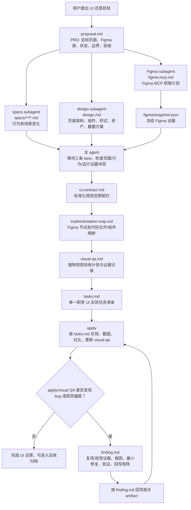

# Figma UI 还原 OpenSpec 工作流说明

本文档基于当前目录结构与 `schema.yaml`，用于说明 `figma-ui-restore` Figma 驱动 UI 高保真还原工作流的阶段、subagent 并行语义、产物依赖、视觉验收 gate 和 Bugfix 回写规则。

`figma-ui-restore` 是 user-level schema，路径为：

```text
/home/gxq/.local/share/openspec/schemas/figma-ui-restore/
```

## 当前结构

```text
.
├── README.md
├── schema.yaml
├── templates/
│   ├── proposal.md
│   ├── spec.md
│   ├── design.md
│   ├── figma-mcp.md
│   ├── figma-snapshot.json
│   ├── ui-contract.md
│   ├── implementation-map.md
│   ├── visual-qa.md
│   ├── tasks.md
│   └── finding.md
└── examples/
    └── figma-mcp-format/
        ├── README.md
        ├── figma.source.example.json
        ├── figma.metadata.example.xml
        ├── figma.design-context.example.tsx
        ├── figma.variable-defs.example.json
        ├── figma.node-source.example.json
        └── figma.handoff.example.yaml
```

- `schema.yaml`: 定义 UI 还原 workflow 的 artifact 生成规则、依赖关系和 apply 阶段行为。
- `templates/`: 当前 workflow 的正式模板。
- `examples/figma-mcp-format/`: 脱敏的 Figma MCP 字段形态参考，不是真实设计数据，也不是实现输入。

## 核心工作流



## 产物职责

### proposal.md

`proposal.md` 是 PRD/source of truth for scope and acceptance，负责固定 UI 还原的目标、Figma 来源、支持状态和验收边界。

必须覆盖：

- 需求概述
- 目标页面、路由、组件或 screen
- Figma URL、fileKey、nodeIds
- 目标平台、viewport、设备或 DPR
- 核心功能描述
- 用户场景和 UI 状态，包含 default、loading、empty、error、disabled、selected 等适用状态
- 还原范围和保真目标
- 功能详情、交互规则、数据状态和兼容约束
- 边界条件和验收标准
- Capabilities，定义后续要创建或修改的 `specs/<capability>/spec.md`
- Impact，说明影响到的 routes、components、styles、APIs、assets 或用户流程

如果 Bugfix 或 visual QA 后发现 scope、target surface、supported state 或 acceptance criteria 变化，需要回写 `proposal.md`。

### specs/**/*.md

`specs/**/*.md` 是 OpenSpec 行为归档，负责描述 UI 背后的可测试行为和场景。

`specs/**/*.md` 必须由独立 specs subagent 生成。该 subagent 的写入范围只限 `specs/**/*.md`，不得写 `design.md`、`figma-mcp.md`、`figma/snapshot.json`、`ui-contract.md`、`implementation-map.md`、`visual-qa.md` 或 `tasks.md`。

职责边界：

- 使用 `## ADDED/MODIFIED/REMOVED/RENAMED Requirements`
- 每个 requirement 使用 `### Requirement:`
- 每个 scenario 使用 `#### Scenario:`
- 使用 SHALL/MUST 描述规范行为
- 覆盖 proposal 中声明的关键 UI 状态和交互场景
- 不写像素布局、组件映射或任务清单

如果 Bugfix 或 visual QA 后发现 behavior 或 scenario 变化，需要回写对应 `specs/<capability>/spec.md`。

### design.md

`design.md` 是技术方案/source of truth for implementation decisions，负责说明如何在目标前端栈中实现 UI 还原。

`design.md` 必须由独立 design subagent 生成。该 subagent 的写入范围只限 `design.md`，不得写 specs、Figma snapshot、UI contract、implementation map、visual QA 或 tasks。

必须覆盖：

- 需求概述
- 目标技术栈、`clientFrameworks`、`clientLanguages`
- 现有 UI 系统、组件库、样式体系和 token 约定
- 页面和路由架构
- API 和数据契约；无 API 变化时写 `Not applicable`
- 组件设计、props/events、state ownership
- 样式和 token 策略
- 资产策略
- 响应式和状态策略
- 技术决策、风险、Open Questions

如果 Bugfix 或 visual QA 后发现 implementation path 或 technical decision 变化，需要回写 `design.md`。

### figma-mcp.md

`figma-mcp.md` 是 Figma MCP 抓取计划和 snapshot contract，负责定义从 Figma 获取哪些证据、保存到哪里、何时刷新、什么情况 blocked。

`figma-mcp.md` 必须由独立 Figma subagent 生成。该 subagent 负责 `figma-mcp.md`、`figma/snapshot.json` 和声明的 raw Figma evidence paths，不得写 specs、design、ui-contract、implementation-map、visual-qa 或 tasks。

必须覆盖：

- MCP setup assumptions 和权限要求
- Figma source URL、fileKey、nodeIds、page/component scope、owner
- target viewport/device
- 必需 MCP tools：`get_metadata`、`get_design_context`、`get_variable_defs`、`use_figma` compact node source、`get_screenshot`
- raw artifact contract：
  - `mcp/<change-or-page>/figma.source.json`
  - `mcp/<change-or-page>/figma.metadata.xml`
  - `mcp/<change-or-page>/figma.design-context.tsx`
  - `mcp/<change-or-page>/figma.variable-defs.json`
  - `mcp/<change-or-page>/figma.node-source.json`
  - `mcp/<change-or-page>/figma.reference.png`
  - `mcp/<change-or-page>/figma.handoff.yaml`
- `figma/snapshot.json` completion signal
- refresh triggers 和 blocked conditions

如果 Figma source、node、抓取策略或证据完整性变化，需要回写 `figma-mcp.md` 并刷新 `figma/snapshot.json`。

### figma/snapshot.json

`figma/snapshot.json` 是 implementation source of truth for Figma evidence。下游 artifact 和 apply 默认只能读取这个冻结快照，不应重新读取 live Figma。

必须包含：

- `sourceUrl`
- `fileKey`
- `nodeIds`
- `capturedAt`
- `clientFrameworks`
- `clientLanguages`
- `tools`
- `rawFilePaths`
- `payload.metadata`
- `payload.designContext`
- `payload.variableDefs`
- `payload.nodeSource`
- `payload.referenceScreenshot`
- `knownGaps`
- `status`

如果 reference screenshot、node source 或 design context 缺失，snapshot 必须标记 blocked，不能继续生成 `tasks.md`。

### ui-contract.md

`ui-contract.md` 是标准化视觉还原契约，负责把 raw Figma evidence 转成实现可用的布局、样式、状态和保真要求。

必须覆盖：

- Source Evidence
- Target Viewports
- Layout Contract
- Typography Contract
- Color and Token Contract
- Spacing, Radius, Border, and Shadow Contract
- Component Hierarchy
- Interaction and State Contract
- Asset Contract
- Fidelity Thresholds
- Known Gaps

规则：

- 不凭空补全缺失 Figma 证据。
- 如果证据不足以定义某项 UI 要求，必须写入 Known Gaps。
- 如果 gap 影响验收，必须阻塞 visual QA。

如果视觉还原契约变化，需要回写 `ui-contract.md`。

### implementation-map.md

`implementation-map.md` 是 Figma 节点和 UI contract 到代码实现的映射表，负责决定 UI 还原工作具体落在哪些 route、component、style、token、asset 文件上。

必须覆盖：

- Target Stack
- Route / Page Mapping
- Figma Node to Component Mapping
- Existing Component Reuse
- New or Modified Components
- Style and Token Mapping
- Asset Mapping
- Data and State Wiring
- File Ownership Boundaries
- Implementation Risks

`tasks.md` 不应该重新发现文件归属或组件映射；这些决策必须先在 `implementation-map.md` 中完成。

如果 file/component mapping 变化，需要回写 `implementation-map.md`。

### visual-qa.md

`visual-qa.md` 是强制视觉验收 gate，负责记录 Figma reference、实现截图、对比结果、偏差、修复和最终 pass/fail。

必须覆盖：

- Visual QA Plan
- Reference Evidence
- Implementation Evidence
- Comparison Results
- Required Fixes
- Final Verdict

规则：

- visual QA 是 hard gate。
- 每个 required viewport/state 都必须有 Figma reference screenshot。
- 每个 required viewport/state 都必须有 implementation screenshot。
- 每个 required viewport/state 都必须有 comparison conclusion。
- 没有证据或结论时，相关 visual QA task 不允许标记完成。

如果 visual evidence 或 pass/fail 变化，需要回写 `visual-qa.md`。

### tasks.md

`tasks.md` 是 apply 阶段唯一进度追踪入口，负责把 proposal、specs、design、ui-contract、implementation-map 和 visual-qa 拆成单一职责 UI 实现任务。

`tasks.md` 由主 agent 在 specs subagent、design subagent 和 Figma subagent 都完成后生成。主 agent 必须先检查三条 lane 的输出是否存在范围、行为、设计证据或实现决策冲突。

规则：

- 使用编号分组，例如 `## 1. Setup and Source Verification`
- 每个任务必须是 checkbox：`- [ ] X.Y Task description`
- 每个 UI 还原任务必须引用 `ui-contract.md` 或 `implementation-map.md`
- 必须包含截图捕获和视觉对比任务
- 必须包含更新 `visual-qa.md` 的任务
- 不允许创建依赖 live Figma 的实现任务，除非先写入显式 refresh task

如果 task breakdown 或 execution order 变化，需要回写 `tasks.md`。

### finding.md

`finding.md` 是可选 Bugfix/视觉偏差调查记录，不属于普通 UI planning 的必需产物。

触发条件：

- apply 或 validation 过程中发现 bug
- 发现 visual mismatch
- 发现回归、异常行为、实现结果不符合预期
- visual QA 无法通过，需要记录根因和最小修复

`finding.md` 必须给出文档回写矩阵：

| Artifact | 回写触发条件 |
| --- | --- |
| `proposal.md` | scope、target surface、supported state 或 acceptance 变化 |
| `design.md` | implementation path 或 technical decision 变化 |
| `specs/<capability>/spec.md` | behavior 或 scenario 变化 |
| `figma-mcp.md` | Figma source 或 extraction rule 变化 |
| `figma/snapshot.json` | frozen design evidence 变化 |
| `ui-contract.md` | restoration contract 变化 |
| `implementation-map.md` | file/component mapping 变化 |
| `visual-qa.md` | visual evidence 或 pass/fail 变化 |
| `tasks.md` | task breakdown 或 execution order 被证明错误 |

如果无需回写，需要明确记录 `No additional artifact backwrite required`。

## Artifact 依赖关系

| Artifact | 生成文件 | 依赖 |
| --- | --- | --- |
| `proposal` | `proposal.md` | 无 |
| `specs` | `specs/**/*.md` | `proposal` |
| `design` | `design.md` | `proposal` |
| `figma-mcp` | `figma-mcp.md` | `proposal` |
| `figma-snapshot` | `figma/snapshot.json` | `figma-mcp` |
| `ui-contract` | `ui-contract.md` | `figma-snapshot` |
| `implementation-map` | `implementation-map.md` | `design`, `ui-contract` |
| `visual-qa` | `visual-qa.md` | `ui-contract`, `implementation-map` |
| `tasks` | `tasks.md` | `specs`, `design`, `ui-contract`, `implementation-map`, `visual-qa` |
| `finding` | `finding.md` | `tasks`，仅 Bugfix/视觉偏差修复时使用 |
| `apply` | 修改代码、截图、视觉对比并追踪 `tasks.md` | `tasks` |

## Subagent 并行语义

- `schema.yaml` 中的 `specs subagent || design subagent || figma-mcp subagent` 表示必须使用 Codex subagent 并行处理三条 planning lane。
- 三条 lane 都只依赖 `proposal`，彼此不存在 OpenSpec `requires` 层面的相互依赖。
- 主 agent 负责 orchestration：分派 subagent、等待结果、检查冲突、生成下游 artifact。
- 并行 lane 的写入范围必须互斥：
  - specs subagent 只写 `specs/**/*.md`
  - design subagent 只写 `design.md`
  - Figma subagent 只写 `figma-mcp.md`、`figma/snapshot.json` 和 raw Figma evidence paths
- `ui-contract.md`、`implementation-map.md`、`visual-qa.md` 和 `tasks.md` 必须在三条 planning lane 完成且主 agent 完成一致性检查后生成。
- apply 阶段如果 `tasks.md` 中存在无共享写入冲突的独立任务组，也应按 Codex subagent 规范拆分执行。

## Source-of-truth 规则

- `proposal.md` owns product scope, target surface, states, and acceptance。
- `design.md` owns implementation decisions。
- `specs/**/*.md` owns behavior and scenarios。
- `figma/snapshot.json` owns frozen Figma evidence。
- `ui-contract.md` owns normalized visual restoration requirements。
- `implementation-map.md` owns code/component/file mapping。
- `visual-qa.md` owns visual evidence and pass/fail。
- `tasks.md` owns apply progress tracking。

## 工作流要点

- 先用 `proposal.md` 固定 UI 还原目标、Figma 来源、支持状态和验收边界。
- specs、design、figma-mcp 从 proposal 通过 subagent 并行生成，但职责和写入范围必须互斥。
- `figma/snapshot.json` 是冻结设计证据；下游默认不重新读取 live Figma。
- `ui-contract.md` 把 Figma raw evidence 转成可实现的视觉契约。
- `implementation-map.md` 先决定代码落点，`tasks.md` 不重复做组件/文件归属判断。
- `visual-qa.md` 是 hard gate；没有截图证据和对比结论不能完成视觉验收任务。
- `finding.md` 只在 Bugfix 或视觉偏差调查时出现，用于记录复现/视觉证据、根因、最小修复、验证和回写决策。

## 校验命令

```bash
openspec schema which figma-ui-restore
openspec schema validate figma-ui-restore
```
