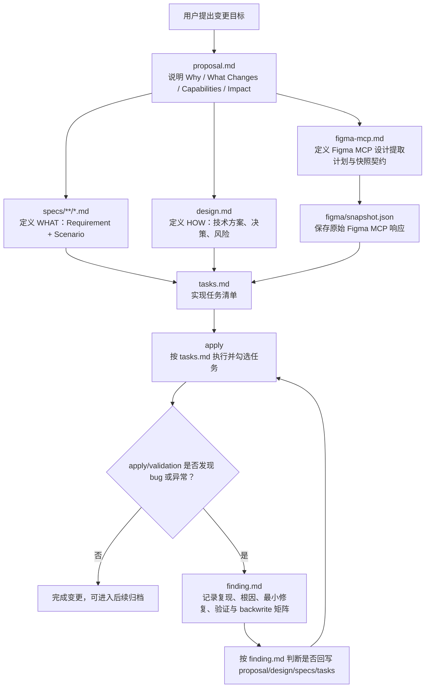
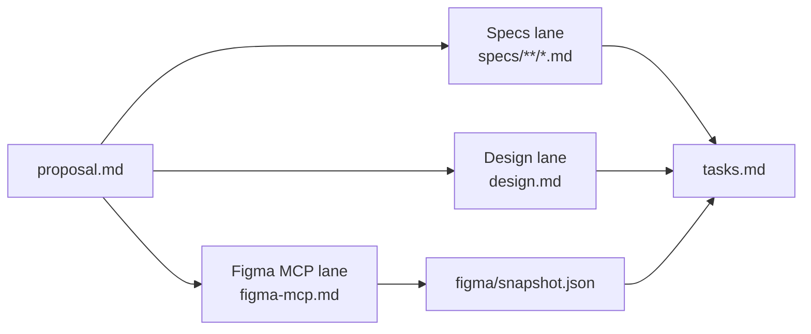

# 自定义 OpenSpec 工作流说明

本文档基于当前目录结构与 `schema.yaml`，用于说明 `spec-parallel` 自定义 OpenSpec 工作流的阶段、产物依赖和执行路径。

## 当前结构

```text
.
├── schema.yaml
├── templates/
│   ├── proposal.md
│   ├── spec.md
│   ├── design.md
│   ├── figma-mcp.md
│   ├── figma-snapshot.json
│   ├── tasks.md
│   └── finding.md
└── examples/
    └── figma-mcp-format/
        ├── README.md
        ├── figma.source.example.json
        ├── figma.metadata.example.xml
        ├── figma.design-context.example.tsx
        ├── figma.variable-defs.example.json
        └── figma.handoff.example.yaml
```

- `schema.yaml`: 定义工作流名称、artifact 生成规则、依赖关系和 apply 阶段行为。
- `templates/`: 每个 artifact 的模板来源。
- `examples/figma-mcp-format/`: 脱敏的 Figma MCP 数据格式参考，只表达字段形态，不是正式 artifact，也不是实际设计输入。

## 核心工作流



## 阶段说明

### 1. proposal

入口 artifact 是 `proposal.md`，它回答为什么要做这次变更，并建立后续阶段的能力边界。

必须明确：

- `Why`: 问题或机会。
- `What Changes`: 新增、修改或移除的能力。
- `Capabilities`: 后续要创建或修改的 spec 名称。
- `Impact`: 影响到的代码、API、依赖或系统。

`Capabilities` 是后续 `specs` 的契约来源。这里列出的每个 capability 都应该对应 `specs/<capability>/spec.md`。

### 2. 并行规划阶段

`proposal.md` 完成后，进入三个可并行的规划 lane：



- `Specs lane`: 负责定义系统应该做什么，即 `REQUIREMENTS` 与可测试 `Scenario`。
- `Design lane`: 负责定义如何实现，包含架构选择、风险、迁移和开放问题。
- `Figma MCP lane`: 负责定义设计源、MCP 提取步骤、快照契约、subagent handoff 和刷新策略。

这三个 lane 要保持独立产出，不互相覆盖职责。`tasks.md` 只有在 `specs`、`design` 和 `figma/snapshot.json` 都就绪后才生成。

### 3. Figma MCP 快照阶段

`figma-mcp.md` 不直接作为实现设计源，它只定义如何抓取、何时刷新、由谁抓取以及输出格式。

真正供 `tasks` 和 `apply` 读取的是：

```text
figma/snapshot.json
```

快照要求：

- 使用 `figma-mcp.md` 中定义的 `fileKey`、`nodeIds` 和范围。
- 保留原始 MCP 响应到 `payload`，避免不同 agent 读取 live Figma 时产生上下文漂移。
- 包含 `capturedAt`、`source`、`fileKey`、`nodeIds`、`mcpTool` 等元信息。
- 如果抓取失败，不创建部分可用的 snapshot，而是在 `figma-mcp.md` 中记录 blocked 状态。

当前仓库的 `examples/figma-mcp-format/` 只展示 MCP 缓存 handoff 的字段形态。它不是实际数据，也不参与 `tasks` 或 `apply` 的设计输入。schema 中正式约定的下游输入仍是 `figma/snapshot.json`。

### examples 数据格式参考

`examples/figma-mcp-format/` 的定位是 fixture/reference：

- 帮助 agent 理解 Figma MCP 相关文件可能有哪些字段。
- 帮助编写 `figma-mcp.md` 时描述 handoff、known gaps 和 recommended reads。
- 不提供真实 `fileKey`、`nodeId`、业务文案或设计资产。
- 不作为 `figma/snapshot.json` 的替代品。

正式 change 生成时，如果需要 Figma 设计上下文，必须重新按 `figma-mcp.md` 抓取并固化为当前 change 自己的 `figma/snapshot.json`。

### 4. tasks

`tasks.md` 是实现阶段的唯一进度追踪入口。模板要求任务必须使用 checkbox：

```md
- [ ] 1.1 Task description
```

规则：

- 按依赖顺序组织任务。
- 设计敏感或前端任务必须明确引用 `figma/snapshot.json`。
- 如果需要重新读取 live Figma MCP，必须作为显式任务写入，而不是在 apply 阶段隐式刷新。

### 5. apply

`apply` 阶段依赖 `tasks.md`：

- 读取上下文文件。
- 按 pending checkbox 执行任务。
- 完成后及时勾选。
- 涉及设计实现时优先读取 `figma/snapshot.json`。
- 默认不重新请求 live Figma MCP，除非任务明确要求，或 snapshot 缺失、过期、不足以实现。

如果存在 `finding.md`，apply 前必须先读取它，避免重复引入已经定位过的问题。

### 6. finding

`finding.md` 是可选的后置修复归档，不属于常规 feature planning 的必需产物。

触发条件：

- apply 或 validation 过程中发现 bug。
- 发现回归、异常行为、实现结果不符合预期。
- 需要记录复现、根因、最小修复和验证结论。

`finding.md` 还负责决定是否回写前置 artifact：

| Artifact | 回写触发条件 |
| --- | --- |
| `proposal.md` | scope 或 acceptance 发生变化 |
| `design.md` | 实现路径或技术决策发生变化 |
| `specs/<capability>/spec.md` | 行为或场景发生变化 |
| `tasks.md` | 任务拆分或执行顺序被证明错误 |

如果无需回写，需要明确记录 `No additional artifact backwrite required`。

## Artifact 依赖关系

| Artifact | 生成文件 | 依赖 |
| --- | --- | --- |
| `proposal` | `proposal.md` | 无 |
| `specs` | `specs/**/*.md` | `proposal` |
| `design` | `design.md` | `proposal` |
| `figma-mcp` | `figma-mcp.md` | `proposal` |
| `figma-snapshot` | `figma/snapshot.json` | `figma-mcp` |
| `tasks` | `tasks.md` | `specs`, `design`, `figma-snapshot` |
| `finding` | `finding.md` | `tasks`，仅 bugfix/异常修复时使用 |
| `apply` | 修改代码并追踪 `tasks.md` | `tasks` |

## 工作流要点

- 先定义变更目标和 capability，再拆 specs、design 和 Figma MCP 规划。
- specs、design、figma-mcp 是并行规划产物，但最终都要汇入 tasks。
- Figma 设计上下文必须通过 snapshot 固化，减少多 agent 或多轮执行中的设计漂移。
- tasks 是 apply 的执行入口，也是进度状态来源。
- finding 是问题修复记录，用于把实际修复经验反向写回 OpenSpec artifact。
