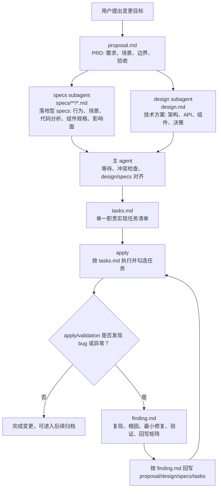

# 自定义 OpenSpec 通用工作流说明

本文档基于当前目录结构与 `schema.yaml`，用于说明 `spec-parallel` 通用 OpenSpec 工作流的阶段、落地型 specs、subagent 并行语义、产物依赖和 Bugfix 回写规则。

## 当前结构

```text
.
├── schema.yaml
├── templates/
│   ├── proposal.md
│   ├── spec.md
│   ├── design.md
│   ├── tasks.md
│   └── finding.md
├── docs/
    └── ui-workflow-seed/
        ├── README.md
        ├── templates/
        │   ├── figma-mcp.md
        │   └── figma-snapshot.json
        └── examples/
            └── figma-mcp-format/
../figma-ui-restore/
├── schema.yaml
├── templates/
└── examples/
```

- `schema.yaml`: 定义通用 workflow 的 artifact 生成规则、依赖关系和 apply 阶段行为。
- `templates/`: 当前通用 workflow 的正式模板。
- `docs/ui-workflow-seed/`: Figma/MCP 相关素材，不属于当前通用 schema。
- `../figma-ui-restore/`: 独立的 Figma UI 还原专用 schema，和 `spec-parallel` 同级。

## 核心工作流



## 全局语言规范

- 整个 `spec-parallel` workflow 的沟通、解释和 artifact 正文默认使用中文。
- technical terms、identifiers、commands、paths、filenames、environment variables、config keys、error messages、logs 和 URLs 保持原文。
- 如需澄清，用中文解释，同时保留原始 term。

## 产物职责

### proposal.md

`proposal.md` 是 PRD/source of truth for scope and acceptance，负责回答要解决什么问题、为谁解决、验收边界是什么。

必须覆盖：

- 需求概述
- 核心功能描述
- 用户场景，包含主流程、替代流程、失败或边界流程
- 功能详情，包含中等粒度的产品和技术约束
- 边界条件，包含 in scope、out of scope、assumptions、acceptance criteria
- Capabilities，定义后续要创建或修改的 `specs/<capability>/spec.md`
- Impact，说明影响到的代码、API、依赖、系统、用户或运维流程

如果 Bugfix 后发现范围或验收口径变化，需要回写 `proposal.md`。

### design.md

`design.md` 是高层技术方案/source of truth for architecture decisions，负责回答如何从架构、API、组件策略和关键技术决策上实现 proposal。

`design.md` 必须由独立 design subagent 生成。该 subagent 的写入范围只限 `design.md`，不得写 `specs/**/*.md` 或 `tasks.md`。

必须覆盖：

- 需求概述
- 架构设计
- API 设计；无 API 变化时写 `Not applicable`
- 组件设计
- 技术决策与取舍
- 风险与缓解
- Open Questions；无未决问题时写 `None`

如果 Bugfix 后发现架构、API contract、组件策略或关键技术决策变化，需要回写 `design.md`。

### specs/**/*.md

`specs/**/*.md` 是落地型 specs，负责描述可测试的行为变化、用户场景，以及该 capability 的具体代码落地规格。

`specs/**/*.md` 必须由独立 specs subagent 生成。该 subagent 的写入范围只限 `specs/**/*.md`，不得写 `design.md` 或 `tasks.md`。specs subagent 可以和 design subagent 并行做仓库代码分析、组件规格、文件修改边界和影响面判断；主 agent 在生成 `tasks.md` 前负责和 `design.md` 对齐。

职责边界：

- 使用 `## ADDED/MODIFIED/REMOVED/RENAMED Requirements`
- 每个 requirement 使用 `### Requirement:`
- 每个 scenario 使用 `#### Scenario:`
- 使用 SHALL/MUST 描述规范行为
- spec 模板和生成规则必须保持通用，不携带业务逻辑、领域示例、具体业务实体、字段名、API 名、路由名或产品文案，除非它们属于当前 change 的真实内容
- 每个 requirement 必须包含 Implementation Details
- Implementation Details 必须覆盖 File Modification Plan、Core Code Landing、Component / Module Split、Impact Surface、Task Breakdown Guidance
- Component / Module Split 必须以通用维度描述复用、新增/修改、拆分/合并、职责边界、依赖方向和 task slicing，不在通用模板里写业务示例
- 不承载高层架构决策；架构、API contract、组件策略和关键取舍属于 `design.md`
- 不承载 executable checkbox checklist；可执行任务属于 `tasks.md`

如果 Bugfix 后发现行为、场景、文件修改边界、核心代码落点、组件/模块拆分、影响面或任务拆分依据变化，需要回写对应 `specs/<capability>/spec.md`。

### tasks.md

`tasks.md` 是 apply 阶段唯一进度追踪入口，负责把已对齐的 proposal/design/specs 拆成单一职责的可执行任务。

`tasks.md` 由主 agent 在 specs subagent 和 design subagent 都完成后生成。主 agent 必须先检查两个并行 lane 的输出是否存在范围、行为、接口、组件边界、文件归属或实现方向冲突；存在冲突时必须先回写对齐相关 artifact，再生成任务。

规则：

- 使用编号分组，例如 `## 1. API Behavior`
- 每个任务必须是 checkbox：`- [ ] X.Y Task description`
- 每个任务应有明确 owner surface、完成信号和验证方式
- 按依赖顺序排列
- 每个任务应引用相关 proposal/design/spec 来源，尤其是 spec 中的 requirement、scenario、file modification plan、core code landing、component/module split 或 impact surface
- 包含必要的测试、回归和验收任务，覆盖用户场景、核心代码回归、组件/模块边界和影响面

如果 Bugfix 后发现任务拆分或执行顺序不合理，需要回写 `tasks.md`。

### finding.md

`finding.md` 是可选 Bugfix 记录，不属于普通 feature planning 的必需产物。

触发条件：

- apply 或 validation 过程中发现 bug
- 发现回归、异常行为、实现结果不符合预期
- 需要记录复现、根因、最小修复和验证结论

`finding.md` 必须给出文档回写矩阵：

| Artifact | 回写触发条件 |
| --- | --- |
| `proposal.md` | scope 或 acceptance 发生变化 |
| `design.md` | architecture、API contract、component strategy 或 key technical decision 发生变化 |
| `specs/<capability>/spec.md` | behavior、scenario、file ownership、core code landing、component/module split、impact surface 或 task breakdown guidance 发生变化 |
| `tasks.md` | task breakdown 或 execution order 被证明错误 |

如果无需回写，需要明确记录 `No additional artifact backwrite required`。

## Artifact 依赖关系

| Artifact | 生成文件 | 依赖 |
| --- | --- | --- |
| `proposal` | `proposal.md` | 无 |
| `specs` | `specs/**/*.md` | `proposal` |
| `design` | `design.md` | `proposal` |
| `tasks` | `tasks.md` | `specs`, `design`，且需先完成 design/specs 对齐 |
| `finding` | `finding.md` | `tasks`，仅 Bugfix/异常修复时使用 |
| `apply` | 修改代码并追踪 `tasks.md` | `tasks` |

## Subagent 并行语义

- `schema.yaml` 中的 `||` 表示必须使用 Codex subagent 并行处理，而不只是文档上的逻辑并行。
- `specs` 与 `design` 都只依赖 `proposal`，二者不存在 OpenSpec `requires` 层面的相互依赖。
- `specs` lane 可以并行做代码分析、组件规格、文件修改边界和影响面判断；`design` lane 并行做高层架构、API、组件策略和关键决策。
- 主 agent 负责 orchestration：分派 subagent、等待结果、检查冲突、完成 design/specs 对齐、生成下游 `tasks.md`。
- 并行 lane 的写入范围必须互斥：specs subagent 只写 `specs/**/*.md`，design subagent 只写 `design.md`。
- apply 阶段如果 `tasks.md` 中存在无共享写入冲突的独立任务组，也应按 Codex subagent 规范拆分执行。

## 工作流要点

- 先用 `proposal.md` 固定需求、场景、边界和验收口径。
- `specs` 和 `design` 从 proposal 通过 subagent 并行生成，但职责不同：specs 管用户场景、行为 delta 和 capability 级代码落地规格；design 管高层技术方案和关键决策。
- `tasks.md` 只在 specs 和 design subagents 都完成且主 agent 完成一致性检查、必要回写和对齐后生成，并作为 apply 的唯一进度来源。
- `finding.md` 只在 Bugfix 或异常调查时出现，用于记录复现、根因、最小修复、验证和回写决策。
- Figma/MCP 不属于当前通用 workflow；真正的 UI 还原流程已拆分到同级 schema `../figma-ui-restore/`。
